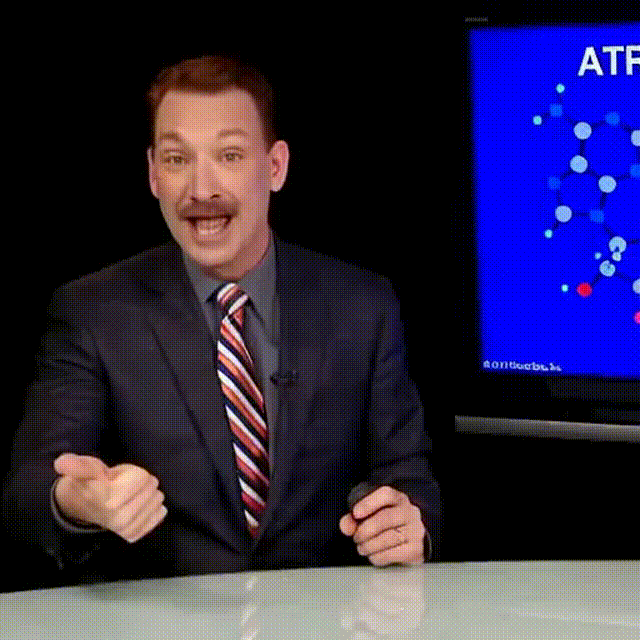
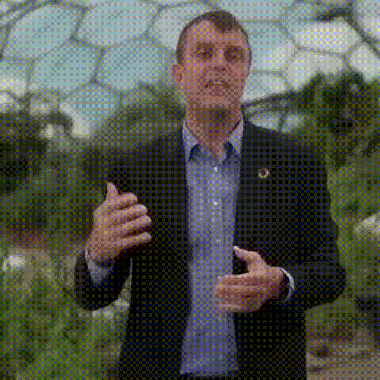
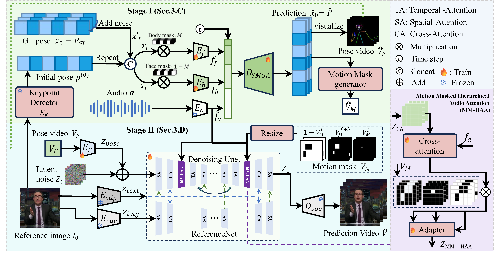

# MMGT
This project is dedicated to co-speech gesture video generation.

## Demo (GIFs)
<p align="center">
  
  
</p>
<p align="center">
  
  
</p>
## News
- **2025-09-01**: Our paper **“MMGT: Motion Mask Guided Two-Stage Network for Co-Speech Gesture Video Generation”** has been **accepted** to **IEEE Transactions on Circuits and Systems for Video Technology (TCSVT)**, 2025.  
  DOI: **10.1109/TCSVT.2025.3604109**
  
<a href="./pipline_1.png">
  
</a>

## Release Plan (Mid-September 2025)
We will open-source in mid-September focusing on **four deliverables**:

1) **Video Demo**  
2) **Inference Code** *(including long-video support)*  
3) **Training Code**  
4) **Multi-person & Multi-scene Weights**

### Timeline (Tokyo time)
- **Sep 1–3** — *Repo prep & Demo*  
  - Finalize repo structure, license, and minimal environment files.  
  - Record a short demo (single image + audio), fix seed, export MP4/GIF.

- **Sep 4–7** — *Inference Code (incl. long-video)*  
  - Ship `infer.py` with `--image_path --audio_path` and sample assets.  
  - Add long-video pipeline (chunking + smoothing), and a quickstart script.

- **Sep 8–11** — *Training Code*  
  - Release a minimal, reproducible training pipeline with configs and a small example dataset recipe.  
  - Define checkpoint I/O (naming, hashes).

- **Sep 12–14** — *Multi-person & Multi-scene Weights*  
  - Train/curate and validate generalized weights.  
  - Publish `weights.md` with download links and checksums. Final doc polish & RC tag.

- **Sep 15** — *Public Release*  
  - Open the repository, publish demo videos, and post a changelog.


## Citation

If you find **MMGT** useful, please cite our TCSVT 2025 paper:

### BibTeX
```bibtex
@ARTICLE{11145152,
  author  = {Wang, Siyuan and Liu, Jiawei and Wang, Wei and Jin, Yeying and Du, Jinsong and Han, Zhi},
  journal = {IEEE Transactions on Circuits and Systems for Video Technology},
  title   = {MMGT: Motion Mask Guided Two-Stage Network for Co-Speech Gesture Video Generation},
  year    = {2025},
  volume  = {},
  number  = {},
  pages   = {1-1},
  keywords= {Videos;Faces;Synchronization;Hands;Lips;Training;Electronic mail;Distortion;Data mining;Circuits and systems;Spatial Mask Guided Audio2Pose Generation Network (SMGA);Co-speech Video Generation;Motion Masked Hierarchical Audio Attention (MM-HAA)},
  doi     = {10.1109/TCSVT.2025.3604109}
}
